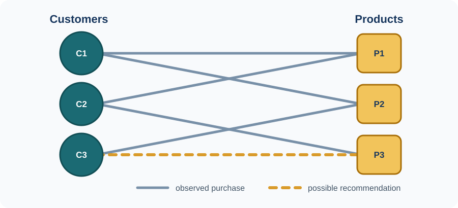

A **graph** is a way to represent entities and the relationships between them. The entities are called **nodes** and their relationships are called **edges**. Both may carry useful information: a customer node might contain age or location, a product node might contain category and price, and an edge might record that a customer bought or rated a product. Road sensors connected by roads, transactions linked by payments and atoms connected by chemical bonds are other examples.

{.graph-example fig-alt="Three customer nodes connected to three product nodes. Solid edges represent purchases and one dashed edge represents a possible recommendation."}

A **graph neural network (GNN)** learns numerical representations, or embeddings, by combining a node's own features with information from its neighbours. In the example, the model can use a customer's previous purchases, the properties of products and patterns from nearby customers to score a new customer-product link. The same principle supports **node classification** (classify a transaction), **link prediction** (recommend a product), and **graph-level prediction** (predict a property of an entire molecule or sensor system).

Each project below asks a specific question about *when and why* the graph helps — not simply whether a GNN can be trained. Students define what the nodes and edges mean, fix a split and a primary metric, and always include a control that tests whether the graph contributes at all.

::: {.category-callout}
**Application project requirements**

Specify a defensible graph construction, a fixed split and primary metric, a non-graph baseline and at least one GNN. Include an edge-removal, edge-randomisation or alternative-graph experiment to test whether the graph contributes.
:::

## Learn first and find ideas

- Begin with [A Gentle Introduction to Graph Neural Networks](https://distill.pub/2021/gnn-intro/), then use the [Stanford CS224W course and project guidance](https://web.stanford.edu/class/cs224w/projects.html) and the [CS224W project archive](https://snap.stanford.edu/class/cs224w-2019/projects.html).
- [PyTorch Geometric dataset catalogue](https://pytorch-geometric.readthedocs.io/en/latest/cheatsheet/data_cheatsheet.html), [Open Graph Benchmark](https://ogb.stanford.edu/docs/home/), [SNAP datasets](https://snap.stanford.edu/data/) and the [Temporal Graph Benchmark](https://tgb.complexdatalab.com/).
- Stanford examples: [traffic as a dynamic graph](https://medium.com/stanford-cs224w/predicting-evolution-of-dynamic-graphs-7688eca1daf8), [water quality with RGCNs](https://medium.com/stanford-cs224w/predicting-water-quality-in-unmonitored-networks-with-rgcns-c72fdd177f0d), [fake-news detection](https://medium.com/stanford-cs224w/are-you-for-real-cb0442af43a3) and [NFT transaction prediction](https://medium.com/stanford-cs224w/applying-graph-ml-techniques-to-ethereum-nft-transactions-d4bde61b02f3).

## Projects in this category

Use the contents panel or the project links in the left navigation to move directly to a project.

## 1.1  Remaining useful life prediction for aircraft engines {#project-1-1}

::: {.project-meta}
TaskGraph-level temporal regression
LevelBSc or MSc
ComputeVery light to light; CPU or 4 GB GPU
Data[NASA C-MAPSS](https://catalog.data.gov/dataset/cmapss-jet-engine-simulated-data) — FD001: 100 training engines, 100 test engines, 21 sensor channels
Starting paperHuang, He and Sick, [Spatio-Temporal Attention GNN for RUL](https://arxiv.org/abs/2401.15964), 2024
:::

::: {.project-intro}
**What you will do.** Predict how many operating cycles remain before a turbofan engine fails. Each sensor channel becomes a node and edges express relationships among sensors. The project's real subject is the graph itself: does it matter how you connect the sensors?
:::

**Data.** Start with FD001; FD002–FD004 are optional transfer sets. Reserve complete training engines for validation and use the official test set for final scores. Split by **engine**, never by window. NASA provides final RUL labels for test engines, so early/middle/late-life analysis belongs on the held-out validation engines. The download is public; NASA does not specify a licence on the catalogue page.

**Methods and code.** Use a GRU or TCN as the graph-free baseline and a compact GCN–GRU or GAT–GRU as the graph model. The [GNN RUL benchmark](https://github.com/Frank-Wang-oss/GNN_RUL_Benchmarking) is a useful reference; a small [PyTorch Geometric](https://pytorch-geometric.readthedocs.io/) implementation is sufficient.

**Baselines and evaluation.** Compare a constant/degradation-stage baseline, one sequence model and one compact GNN. Use MAE or RMSE as primary, and report three seeds for MSc work.

::: {.scope .scope-bsc}
**Bachelor research question.** **How sensitive is GNN-based remaining-useful-life prediction to the way the sensor graph is constructed?**

*Core experiment.* Keep the model fixed and compare correlation, sensor-similarity, random and no-edge graphs, plus the graph-free sequence baseline.

**Interpretation.** FD001 has only 21 sensor channels, so the graph may add little beyond temporal modelling. A correlation graph performing no better than a random graph is a valid result.
:::

::: {.scope .scope-msc}
**Master research question.** **Can a sparse, time-varying sensor graph improve accuracy when sensors are noisy or missing?** Develop one graph-learning mechanism, compare it with fixed and random graphs at matched capacity, and add one robustness or cross-subset transfer study.
:::

**Practical notes.** Fix the RUL cap, normalisation and metric before modelling; changing them makes published results incomparable.

<a href="#top">Back to category introduction ↑</a>

---

## 1.2  Multi-horizon traffic forecasting with data-driven graph structure {#project-1-2}

::: {.project-meta}
TaskNode-level temporal regression
LevelBSc or MSc
ComputeLight to moderate; 4–8 GB GPU
Data[METR-LA](https://github.com/liyaguang/DCRNN) — 207 sensors, 34,272 five-minute observations; PEMS-BAY optional
Starting paperWu et al., [Graph WaveNet](https://arxiv.org/abs/1906.00121), IJCAI 2019
:::

::: {.project-intro}
**What you will do.** Forecast traffic speed at every road sensor 15, 30 and 60 minutes ahead, and determine when the road network's structure actually helps. Short-horizon forecasts may depend mostly on a sensor's own recent history, while longer horizons may require information propagating through the network.
:::

**Data.** Use METR-LA with the standard chronological 70/10/20 split. Fit scalers and learned/correlation graphs on training data only. The files are publicly downloadable through DCRNN, but no separate dataset licence is stated there; do not redistribute them.

**Methods and code.** Compare historical average and a graph-free GRU with [Graph WaveNet](https://github.com/nnzhan/Graph-WaveNet) or a compact STGCN. DCRNN is optional because its reference implementation is slower and uses an old TensorFlow stack.

**Baselines and evaluation.** Use historical average, graph-free GRU, and the same GNN with distance, randomised and identity/no-message-passing graphs. Report masked MAE (primary), RMSE and MAPE at 15, 30 and 60 minutes.

::: {.scope .scope-bsc}
**Bachelor research question.** **Does graph information become more valuable as the forecasting horizon increases?**

*Core experiment.* With one trained 12-step model, compare the distance, randomised and identity/no-message-passing graphs at steps 3, 6 and 12 (15, 30 and 60 minutes). Include the graph-free GRU as a separate baseline.

**Note.** Evaluate one 12-step model at different horizons; do not train three separate models.
:::

::: {.scope .scope-msc}
**Master research question.** **Does a sparse, traffic-regime-conditioned adjacency improve 60-minute forecasts over road and learned static graphs?** Match model capacity, use three seeds, and analyse whether edges change plausibly between rush hour and free flow.
:::

**Practical notes.** Profile early and use top-k or low-rank adjacency; a dense graph at every time step is unnecessarily expensive.

<a href="#top">Back to category introduction ↑</a>

---

## 1.3  Illicit Bitcoin transaction detection {#project-1-3}

::: {.project-meta}
TaskNode classification on a temporal graph
LevelBSc or MSc
ComputeLight to moderate; the full graph fits on a 4–8 GB GPU
Data[Elliptic Bitcoin dataset via PyG](https://pytorch-geometric.readthedocs.io/en/latest/generated/torch_geometric.datasets.EllipticBitcoinDataset.html) — 203,769 nodes, 234,355 edges, 165 model features, 49 time steps
Starting paperWeber et al., [Anti-Money Laundering in Bitcoin](https://arxiv.org/abs/1908.02591), 2019
:::

::: {.project-intro}
**What you will do.** Classify labelled Bitcoin transactions as licit or illicit, then test how missing payment edges affect the result.
:::

**Data.** The PyG loader downloads the data and defines time steps 1–34 as training and 35–49 as test; take validation steps only from 1–34. Unknown labels are **unlabelled**, not negatives. The dataset is CC BY-NC-ND 4.0: academic analysis is allowed, but commercial use and redistribution of modified data are restricted.

**Methods and code.** Compare logistic regression or random forest with GCN and GraphSAGE in [PyTorch Geometric](https://pytorch-geometric.readthedocs.io/). Use class weighting only after the unweighted baseline is established.

**Baselines and evaluation.** Use the first 93 PyG features for the truly local, graph-free baseline. Report a second 165-feature baseline separately because the last 72 features already aggregate neighbours. Compare both with GCN/GraphSAGE and a no-edge control. Use AUPRC or illicit-class F1 as primary and report performance by time step.

::: {.scope .scope-bsc}
**Bachelor research question.** **How robust are GNN-based illicit-transaction detectors when graph information is incomplete?**

*Core experiment.* Delete 0%, 10%, 25% and 50% of test edges and compare both GNNs with the 93-feature local baseline. Repeat deletion with several random seeds.

**Interpretation.** A 165-feature random forest is a strong baseline partly because 72 features already summarise neighbours. Keep it, but do not call it graph-free.
:::

::: {.scope .scope-msc}
**Master research question.** **Can a temporally calibrated GNN remain useful under concept drift and missing edges?** Add one temporal or uncertainty mechanism and evaluate it by time step and at a fixed alert budget.
:::

**Practical notes.** The 49 time steps are disconnected snapshots. Preserve time order and keep label handling and threshold selection identical across methods.

<a href="#top">Back to category introduction ↑</a>

---

## 1.4  Graph-based movie recommendation with accuracy and coverage {#project-1-4}

::: {.project-meta}
TaskLink prediction and ranking on a bipartite graph
LevelBSc only
ComputeVery light; CPU or low-memory GPU
Data[MovieLens 100K](https://grouplens.org/datasets/movielens/100k/) — 100,000 ratings, 943 users, 1,682 movies, 5 MB
Starting paperHe et al., [LightGCN](https://arxiv.org/abs/2002.02126), SIGIR 2020
:::

::: {.project-intro}
**What you will do.** Rank unseen films for each user and test whether better ranking accuracy reduces catalogue coverage or long-tail exposure.
:::

**Data.** Treat ratings of 4–5 as positive interactions. Split each user's positives chronologically and remove validation/test edges from the training graph. Evaluate over the full unseen catalogue. The download is public for research, but its licence forbids redistribution and commercial use without permission.

**Methods and code.** Compare popularity, BPR matrix factorisation and LightGCN. A direct [PyTorch Geometric](https://pytorch-geometric.readthedocs.io/) implementation is simpler than adapting the [official LightGCN repository](https://github.com/kuandeng/LightGCN).

**Baselines and evaluation.** Use identical training negatives for BPR-MF and LightGCN. Report NDCG@20 or Recall@20, catalogue coverage and average recommended-item popularity.

::: {.scope .scope-bsc}
**Bachelor research question.** **Does graph-based recommendation improve ranking accuracy at the expense of catalogue coverage and long-tail exposure?**

*Core experiment.* Compare the three methods, then vary LightGCN depth or its training negative sampler and plot the accuracy/coverage trade-off. Use at least three seeds and analyse results by user activity and item popularity.
:::

**Practical notes.** Avoid future-interaction leakage and sampled-negative evaluation. Submit a reproducible pipeline, controlled comparison and error analysis.

<a href="#top">Back to category introduction ↑</a>

---

## 1.5  Molecular HIV activity prediction with calibrated GNNs {#project-1-5}

::: {.project-meta}
TaskGraph classification under distribution shift
LevelBSc or MSc
ComputeLight to moderate; 4–8 GB GPU
Data[OGB ogbg-molhiv](https://ogb.stanford.edu/docs/graphprop/#ogbg-mol) — 41,127 molecular graphs, official scaffold split and evaluator
Starting paperHu et al., [Open Graph Benchmark](https://arxiv.org/abs/2005.00687), NeurIPS 2020
:::

::: {.project-intro}
**What you will do.** Predict HIV-assay activity and test whether a GNN generalises to unseen molecular scaffolds better than chemical fingerprints.
:::

**Data.** The [OGB loader](https://ogb.stanford.edu/docs/home/) automatically downloads the MIT-licensed data and supplies the scaffold split and evaluator. Do not compare scaffold-split results with random-split figures.

**Methods and code.** Compare Morgan fingerprints with logistic regression or random forest via [RDKit](https://www.rdkit.org/) against GCN and edge-aware GINE models. OGB and [PyTorch Geometric](https://pytorch-geometric.readthedocs.io/) provide loaders and baseline components.

**Baselines and evaluation.** Use a fingerprint classifier, GCN and GINE, with one bond-feature ablation. Report ROC-AUC (official primary metric), AUPRC and three seeds.

::: {.scope .scope-bsc}
**Bachelor research question.** **Do GNNs generalise better than traditional molecular fingerprints to scaffolds not seen during training?**

*Core experiment.* Compare fingerprints, GCN and GINE on the official split, then inspect errors on scaffolds most dissimilar to training data.

**Interpretation.** A fingerprint/tree model may match or beat a plain GNN. Select all hyperparameters on validation data; never tune against the test split.
:::

::: {.scope .scope-msc}
**Master research question.** **Can calibration improve on held-out scaffolds without reducing ROC-AUC?** Compare temperature scaling with one ensemble or uncertainty method and report calibration by scaffold novelty.
:::

**Practical notes.** Keep the official split and evaluator fixed; choose thresholds and calibration parameters on validation data only.

<a href="#top">Back to category introduction ↑</a>

