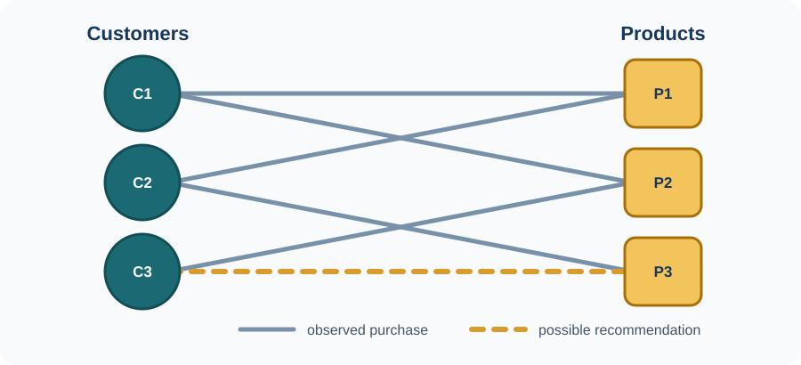

A **graph** is a way to represent entities and the relationships between them. The entities are called **nodes** and their relationships are called **edges**. Both may carry useful information: a customer node might contain age or location, a product node might contain category and price, and an edge might record that a customer bought or rated a product. Road sensors connected by roads, transactions linked by payments and atoms connected by chemical bonds are other examples.

{.graph-example fig-alt="Three customer nodes connected to three product nodes. Solid edges represent purchases and one dashed edge represents a possible recommendation."}

A **graph neural network (GNN)** learns numerical representations, or embeddings, by combining a node's own features with information from its neighbours. In the example, the model can use a customer's previous purchases, the properties of products and patterns from nearby customers to score a new customer-product link. The same principle supports **node classification** (classify a transaction), **link prediction** (recommend a product), and **graph-level prediction** (predict a property of an entire molecule or sensor system).

Each project asks when relationships between entities help prediction. Students begin with one simple reference model and one graph model, then investigate the value of the graph.

## Learn first and find ideas

- [A Gentle Introduction to Graph Neural Networks](https://distill.pub/2021/gnn-intro/).
- [Stanford CS224W course and project guidance](https://web.stanford.edu/class/cs224w/projects.html).
- [PyTorch Geometric code and examples](https://github.com/pyg-team/pytorch_geometric).

## Projects in this category

Use the contents panel or the project links in the left navigation to move directly to a project.

## 2.1  Predicting the remaining life of aircraft engines {#project-2-1}

::: {.project-meta}
LevelBSc or MSc
ComputingStart with a small model; a GPU can help with training.
:::

**Goal**

Predict how many operating cycles remain before a simulated aircraft engine fails. Investigate whether sharing information between related sensor channels improves predictions, and how the choice of sensor connections affects the result.

**Data and starting material**

Use the FD001 subset of [NASA C-MAPSS](https://catalog.data.gov/dataset/cmapss-jet-engine-simulated-data), which contains simulated engine-degradation measurements from 21 sensor channels. It provides 100 training engines and 100 test engines.

- [Spatio-Temporal Attention GNN for Remaining Useful Life Prediction](https://arxiv.org/abs/2401.15964).
- [GNN remaining-life benchmark code](https://github.com/Frank-Wang-oss/GNN_RUL_Benchmarking).

**Methods and evaluation**

Explore time-series neural networks and spatiotemporal graph neural networks, which combine changes over time with relationships between sensors. Start with one model using sensor histories and one graph model.

Keep complete engines separate between training and evaluation, and measure the error in predicted remaining life. Compare meaningful sensor connections with shuffled connections and a version without information sharing.

::: {.scope .scope-bsc}
**Bachelor focus.** How much does the choice of connections between sensors affect remaining-life prediction?
:::

::: {.scope .scope-msc}
**Master extension.** Explore a model that adjusts sensor connections as an engine ages. Test whether it handles noisy or missing sensor measurements better than fixed connections.
:::

<a href="#top">Back to category introduction ↑</a>

---

## 2.2  Predicting traffic speed with graph neural networks {#project-2-2}

::: {.project-meta}
LevelBSc or MSc
ComputingA GPU is recommended; requirements depend on the chosen model.
:::

**Goal**

Predict traffic speed at road sensors **15, 30 and 60 minutes ahead**. Investigate whether using information from connected sensors improves predictions compared with using each sensor’s own history, and whether this becomes more useful when forecasting further ahead. Each sensor represents a location in a graph; its connections allow the model to learn how traffic conditions at different locations relate to one another.

**Data and starting material**

Use **METR-LA**, which contains traffic-speed measurements from 207 sensors in Los Angeles, recorded every five minutes.

- [Dataset access and preparation instructions](https://github.com/liyaguang/DCRNN).
- [Graph WaveNet paper and authors’ code](https://github.com/nnzhan/Graph-WaveNet).

**Methods and evaluation**

Explore simple forecasting methods, time-series neural networks and **spatiotemporal graph neural networks**, which learn from both changes over time and relationships between sensors. Start with a simple reference method and one graph model.

Evaluate predictions on later data that the models have not seen, using average prediction error at the three forecasting horizons. Compare meaningful sensor connections with shuffled connections and a version without information sharing between sensors to establish when the graph helps.

::: {.scope .scope-bsc}
**Bachelor focus.** Does information from connected sensors become more useful when predicting 60 minutes ahead than when predicting 15 minutes ahead?
:::

::: {.scope .scope-msc}
**Master extension.** Explore a model that adjusts sensor connections as traffic conditions change. Test whether this improves 60-minute forecasts compared with connections that stay fixed, including during rush hour.
:::

<a href="#top">Back to category introduction ↑</a>

---

## 2.3  Detecting illicit Bitcoin transactions with graphs {#project-2-3}

::: {.project-meta}
LevelBSc or MSc
ComputingA GPU is useful for graph models; begin with a small experiment.
:::

**Goal**

Identify transactions labelled as associated with illicit activity. Investigate whether payment connections improve classification, and whether the model remains useful when some connections are missing.

**Data and starting material**

Use the [Elliptic Bitcoin dataset through PyTorch Geometric](https://pytorch-geometric.readthedocs.io/en/latest/generated/torch_geometric.datasets.EllipticBitcoinDataset.html). It provides transaction features, payment connections and labels for a subset of transactions. Transactions with unknown labels must remain unlabelled.

- [Dataset paper: Anti-Money Laundering in Bitcoin](https://arxiv.org/abs/1908.02591).
- [PyTorch Geometric code and examples](https://github.com/pyg-team/pytorch_geometric).

**Methods and evaluation**

Explore conventional classifiers, such as random forests, and graph neural networks that use neighbouring transactions. Include a comparison using only the transaction’s own features, since some supplied features already summarise neighbours.

Train on earlier transactions and evaluate on later ones. Measure how well the models find illicit transactions while limiting false alarms, and repeat the comparison after removing some payment connections.

::: {.scope .scope-bsc}
**Bachelor focus.** How much does missing payment information affect graph-based detection?
:::

::: {.scope .scope-msc}
**Master extension.** Explore a model that accounts for changes over time or estimates uncertainty. Test whether its predictions remain reliable as transaction patterns change.
:::

<a href="#top">Back to category introduction ↑</a>

---

## 2.4  Recommending movies with graph neural networks {#project-2-4}

::: {.project-meta}
LevelBSc only
ComputingA CPU or a small GPU is suitable for initial experiments.
:::

**Goal**

Recommend films that a user has not yet rated. Investigate whether a graph of users and their ratings improves recommendations, and whether better accuracy comes at the cost of recommending a narrower range of films.

**Data and starting material**

Use [MovieLens 100K](https://grouplens.org/datasets/movielens/100k/), which contains 100,000 ratings from 943 users on 1,682 movies. The project uses ratings to identify films users like.

- [LightGCN paper and authors’ code](https://github.com/kuandeng/LightGCN).

**Methods and evaluation**

Explore popularity-based recommendation, matrix factorisation and graph-based recommendation, such as LightGCN. These approaches respectively use overall popularity, shared user–film patterns and connections in the rating graph.

Evaluate on later ratings kept out of the training graph. Compare recommendation quality and how widely the recommendations cover the film catalogue, including less popular films.

::: {.scope .scope-bsc}
**Bachelor focus.** Does graph-based recommendation improve accuracy while still exposing users to a broad range of films? Study one factor, such as how far information travels through the graph.
:::

<a href="#top">Back to category introduction ↑</a>

---

## 2.5  Predicting molecular activity with graph neural networks {#project-2-5}

::: {.project-meta}
LevelBSc or MSc
ComputingA GPU is recommended for the graph models.
:::

**Goal**

Predict whether a molecule is active in an HIV screening assay. Investigate whether representing atoms and bonds as a graph helps the model generalise to molecular structures different from those used for training.

**Data and starting material**

Use [OGB ogbg-molhiv](https://ogb.stanford.edu/docs/graphprop/#ogbg-mol), which contains 41,127 molecular graphs and an official split based on molecular structure. This is an assay-prediction task.

- [Open Graph Benchmark paper and code](https://github.com/snap-stanford/ogb).
- [RDKit chemical-feature tools](https://www.rdkit.org/).

**Methods and evaluation**

Explore conventional classifiers using molecular fingerprints, which summarise chemical structure, and graph neural networks using atoms and bonds. Start with one fingerprint model and one graph model.

Use the official dataset split to evaluate on different molecular structures. Compare how well models distinguish active from inactive molecules and examine where their predictions fail.

::: {.scope .scope-bsc}
**Bachelor focus.** Do graph neural networks generalise to new molecular structures better than traditional molecular fingerprints?
:::

::: {.scope .scope-msc}
**Master extension.** Explore methods that make prediction confidence more reliable on unfamiliar structures. Test whether improved confidence estimates preserve classification performance.
:::

<a href="#top">Back to category introduction ↑</a>

