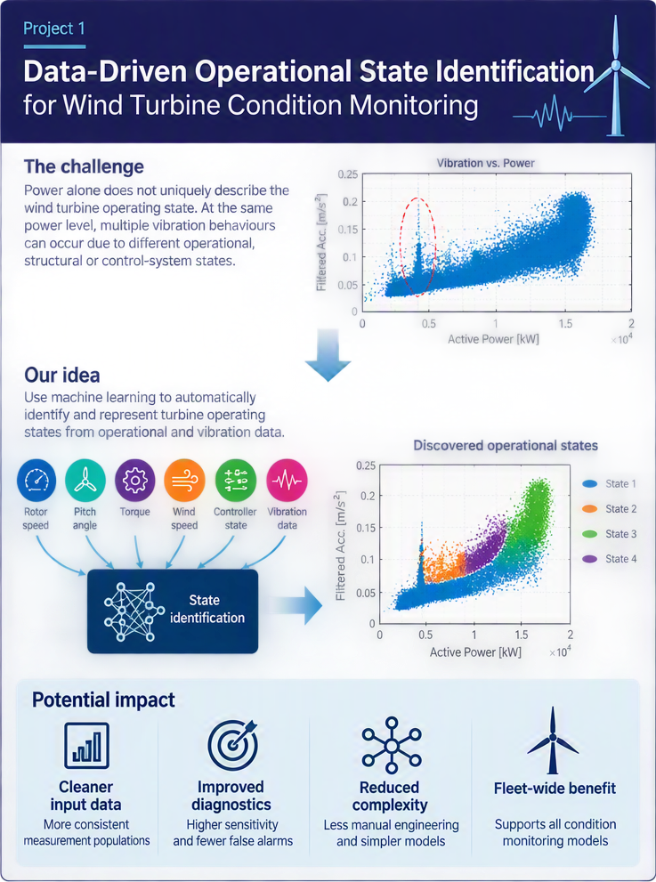
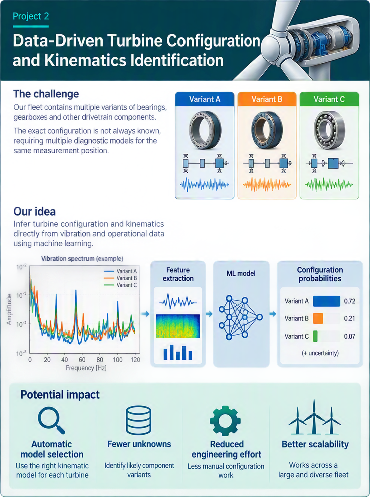

These projects are developed with Siemens Gamesa and Tetra Pak using non-public operational data. At the start of each project, the student, supervisor and partner will confirm the available data, downstream task and permitted outputs.

All three are primarily Master projects. A reduced Bachelor version can be offered when a prepared dataset and fixed task are available. The Bachelor project implements and compares established methods; the Master project adds a new representation, feature design or evaluation question.

**Evaluation split.** Keep all measurements from one turbine or filtration cycle in the same split. A held-out site or production line can be used as an additional Master-level transfer test when enough data are available.

## Learn first and find ideas

- Wind-turbine vibration analysis: Randall and Antoni, [Rolling element bearing diagnostics — a tutorial](https://doi.org/10.1016/j.ymssp.2010.07.017), *Mechanical Systems and Signal Processing*, 2011.
- Time-series representation learning: [TS2Vec](https://github.com/zhihanyue/ts2vec), [TS-TCC](https://github.com/emadeldeen24/TS-TCC) and [SimMTM](https://github.com/thuml/SimMTM).
- Time-series baselines: [ROCKET and MiniRocket](https://github.com/angus924/rocket) and [InceptionTime](https://github.com/hfawaz/InceptionTime).
- For every project, state how the result would be used: for example, choosing an operating-state model, selecting a drivetrain configuration, or flagging a filtration cycle for review.

## Projects in this category

Use the contents panel or the project links in the left navigation to move directly to a project.

## 1.1  Siemens Gamesa: Data-driven operational state identification for wind turbine condition monitoring {#project-1-1}

::: {.project-meta}
TaskUnsupervised operating-state discovery followed by condition-monitoring evaluation
LevelMSc preferred; reduced BSc version possible
ComputeLight to moderate; compact models on a 4–8 GB GPU
DataPartner-supplied Siemens Gamesa vibration and operational data; not public
Starting paperYue et al., [TS2Vec](https://arxiv.org/abs/2106.10466), AAAI 2022
:::

::: {.project-intro}
**What you will do.** Wind-turbine monitoring systems often group vibration measurements by power output. However, turbines producing the same power can show different vibration behaviour. You will test whether operating states learned from vibration and operational measurements describe the turbine more consistently than power bins.
:::

{.industry-project-figure loading="lazy"}

**Project goal.** Discover recurring operating states and determine whether using those states improves a downstream condition-monitoring model. The project should answer whether the learned states contain useful information beyond turbine power. Where possible, the discovered operating states should be interpreted in relation to known turbine operating regimes, controller actions, or structural and aerodynamic phenomena.

**Data.** Siemens Gamesa will provide anonymised turbine data under an agreed access arrangement. The data may include vibration features or spectra together with variables such as power, rotor or generator speed, pitch angle, torque, wind conditions and controller information. The exact channels, number of turbines, time period and sampling format must be confirmed before allocation.

**Methods and code.** Start with power binning, PCA and one clustering method such as k-means or a Gaussian mixture. Then test one representation-learning approach, such as [TS2Vec](https://github.com/zhihanyue/ts2vec), followed by clustering. Use UMAP only for visualisation, not as evidence that the states are valid.

**Baselines and evaluation.** Compare power bins, clustering on standardised operational variables, and clustering on the learned representation. Evaluate whether states are stable across held-out turbines or time periods and whether they have a clear operational interpretation. The main downstream comparison uses the same condition-monitoring or anomaly model with power-bin conditioning and learned-state conditioning. Report residual variation and, if suitable event or alarm labels are available, detection performance and false-alarm rate.

::: {.scope .scope-msc}
**Master research question.** **Do data-driven operating states describe wind-turbine vibration more consistently than power bins, and do they improve downstream condition monitoring?** The contribution is the state representation and a controlled comparison showing when it improves—or does not improve—the downstream model. Include stability analysis and one ablation of the input variables or representation method.
:::

::: {.scope .scope-bsc}
**Bachelor version.** Using a prepared feature table, compare power binning with one clustering method. Describe the resulting states using the available operational variables and measure how much within-state vibration variation each grouping removes. Representation learning is not required.
:::

**Practical notes.** Unsupervised clusters are not automatically physical operating states. Do not judge the result only by silhouette score or a two-dimensional plot. A useful state should be repeatable, physically interpretable where possible, and should improve an agreed downstream measure.

<a href="#top">Back to category introduction ↑</a>

---

## 1.2  Siemens Gamesa: Probabilistic drivetrain configuration and kinematics identification from vibration signals {#project-1-2}

::: {.project-meta}
TaskProbabilistic ranking of candidate drivetrain configurations from vibration and operational measurements
LevelMSc preferred; reduced BSc version possible
ComputeLight to moderate; compact models on a 4–8 GB GPU
DataPartner-supplied Siemens Gamesa data with configuration information for a subset of turbines; not public
Starting paperDempster, Petitjean and Webb, [ROCKET](https://arxiv.org/abs/1910.13051), DMKD 2020
:::

::: {.project-intro}
**What you will do.** A wind-turbine fleet can contain several bearing, gearbox or drivetrain variants, and the monitoring system may not always know which configuration is installed. Because component geometry affects the vibration spectrum, you will test whether measured vibration and operational data can narrow the set of plausible configurations and provide probabilities or confidence estimates for the candidates.
:::

{.industry-project-figure loading="lazy"}

**Project goal.** Use vibration and operational measurements to determine whether fixed drivetrain hardware variants can be distinguished and, when candidate configurations are known, rank the most plausible configurations for each turbine. Verified configuration information for a subset of turbines or components will be used to validate and calibrate the rankings. As an optional physics-informed extension, condition the model on known bearing or drivetrain kinematics and test whether relationships learned from well-documented components can be transferred to more complex components with limited labels.

**Data.** Siemens Gamesa will provide anonymised vibration and operational measurements, potentially with verified configuration information for a subset of turbines. Before allocation, confirm the number of turbines and configuration classes, how the configuration labels were obtained, the measurement positions, sampling format, and whether raw waveforms, spectra or extracted features are available. The probabilistic ranking study requires enough independent turbines for each candidate configuration.

**Methods and code.** Begin with a probabilistic baseline such as multinomial logistic regression, or a random-forest or gradient-boosting model that outputs candidate probabilities, using the supplied spectral and operational features. If sequences or spectra are available, compare [MiniRocket](https://github.com/angus924/rocket), [InceptionTime](https://github.com/hfawaz/InceptionTime) or a compact 1-D CNN, followed by probability calibration when needed. If speed and component geometry are available, add order-domain or characteristic-frequency features as a physics-informed extension. An advanced extension can condition the model on known kinematic parameters so that it learns how vibration patterns relate to machine properties rather than merely memorising component identities.

**Baselines and evaluation.** Compare prior-probability and operational-metadata baselines with feature-based and learned vibration models. Treat the output as a ranked probability distribution over candidate configurations rather than only a fixed assignment. Split by turbine; use a site-grouped test only if the data contain enough sites and classes. Report balanced accuracy and macro-F1 for the highest-ranked candidate, top-k candidate recall, and a probabilistic score such as log loss or the Brier score. Also report calibration and coverage: how often can the system make an automatic decision above a chosen confidence threshold, and how often is that decision correct?

::: {.scope .scope-msc}
**Master research question.** **Can vibration and operational measurements narrow the set of plausible drivetrain configurations and provide calibrated confidence estimates beyond what operational metadata already reveals?** The contribution may be a calibrated candidate-ranking method, a physics-informed feature set or a model conditioned on kinematic information. Include a metadata-only control and analyse performance across operating conditions.
:::

::: {.scope .scope-bsc}
**Bachelor version.** Using a prepared feature table and verified configuration labels, compare one probabilistic classifier with the metadata-only baseline on turbine-grouped splits. Report both the highest-ranked classification result and whether the true configuration appears among the top candidate configurations. Identify the most informative spectral or operational features.
:::

<a href="#top">Back to category introduction ↑</a>

---

## 1.3  Tetra Pak: Regime-aware self-supervised learning for non-stationary filtration cycles {#project-1-3}

::: {.project-meta}
TaskSelf-supervised multivariate time-series learning followed by cycle-level regression or anomaly detection
LevelMSc preferred; reduced BSc version possible
ComputeLight to moderate; compact models on a 4–8 GB GPU
DataPartner-supplied Tetra Pak filtration-process data; not public
Starting paperYue et al., [TS2Vec](https://arxiv.org/abs/2106.10466), AAAI 2022
:::

::: {.project-intro}
**What you will do.** Membrane-filtration plants generate repeated production and cleaning cycles containing flow, pressure, temperature and energy measurements. Because operating conditions differ between cycles, you will learn representations that account for this variation and test them on one agreed prediction or anomaly-detection task.
:::

**Project goal.** Determine whether cycle-phase- and operating-regime-aware self-supervised learning separates normal process variation from inefficient or abnormal behaviour better than a generic time-series representation.

**Data.** Tetra Pak will provide anonymised process data or access through a secure environment. Possible variables include cycle boundaries, flow, pressure, temperature, power or energy, setpoints and operating conditions. The number of independent cycles, sampling rate, available plants or lines, and downstream target must be confirmed before allocation. Split by complete cycle and preserve time order.

**Methods and code.** Use one established method—[TS2Vec](https://github.com/zhihanyue/ts2vec), [TS-TCC](https://github.com/emadeldeen24/TS-TCC) or [SimMTM](https://github.com/thuml/SimMTM)—with a compact 1-D CNN, TCN or GRU encoder. Compare generic augmentations with a cycle-phase- or regime-aware view or masking design. Change-point detection or clustering may be used to describe operating regimes.

**Baselines and evaluation.** Compare a statistical baseline, a supervised TCN or GRU, generic self-supervised learning and the proposed regime-aware version. Include random-frozen and frozen-probe controls. Use MAE for early prediction of final specific energy, or AUPRC for an agreed anomaly label. Report a label-efficiency curve and use several seeds when the number of independent cycles permits.

::: {.scope .scope-msc}
**Master research question.** **Can cycle-phase- and operating-regime-aware self-supervised views improve prediction or anomaly detection across non-stationary filtration cycles?** The contribution is the process-aware view or masking design and its matched comparison with generic augmentations, including transfer to a held-out regime, line or product when the data support it.
:::

::: {.scope .scope-bsc}
**Bachelor version.** Using pre-segmented filtration cycles and a fixed downstream target, compare one statistical or supervised baseline with one established self-supervised method. Use cycle-grouped splits and evaluate a frozen representation with a small prediction head. Designing a new augmentation or representation is not required.
:::

**Practical notes.** Confirm the independent-cycle count and one measurable downstream target before allocation. Rerunning an unchanged self-supervised method is a baseline, not the Master contribution. Follow the [shared protocol for self-supervised projects](https://nrehman-au.github.io/Student-projects/#shared-protocol-for-self-supervised-projects).

<a href="#top">Back to category introduction ↑</a>

