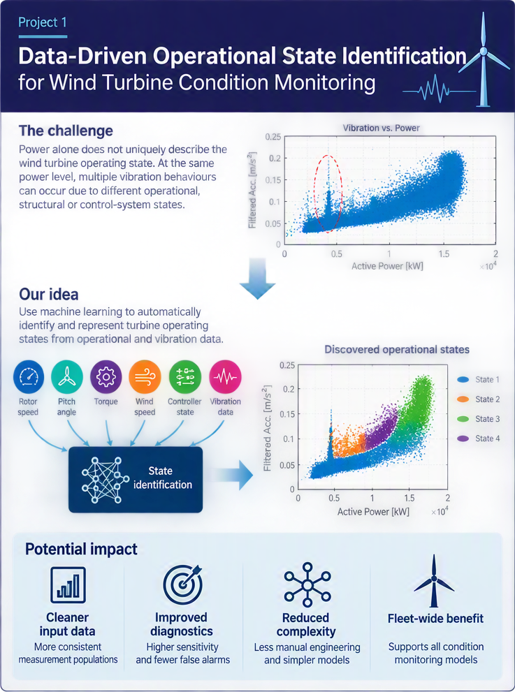
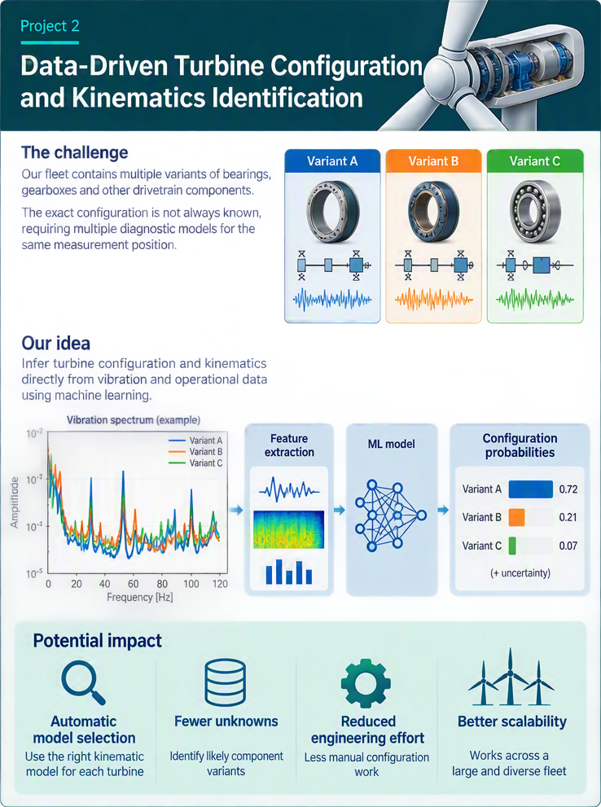

These projects are developed with Siemens Gamesa and Tetra Pak using non-public operational data. At the start of each project, the student, supervisor and partner will confirm the available data, downstream task and permitted outputs.

All three are primarily Master projects. A reduced Bachelor version can be offered when a prepared dataset and fixed task are available. The Bachelor project implements and compares established methods; the Master project adds a new representation, feature design or evaluation question.

**Evaluation split.** Keep all measurements from one turbine or filtration cycle in the same split. A held-out site or production line can be used as an additional Master-level transfer test when enough data are available.

## Learn first and find ideas

- Wind-turbine vibration analysis: Randall and Antoni, [Rolling element bearing diagnostics — a tutorial](https://doi.org/10.1016/j.ymssp.2010.07.017), *Mechanical Systems and Signal Processing*, 2011.
- Time-series representation learning: [TS2Vec](https://github.com/zhihanyue/ts2vec), [TS-TCC](https://github.com/emadeldeen24/TS-TCC) and [SimMTM](https://github.com/thuml/SimMTM).
- Time-series baselines: [ROCKET and MiniRocket](https://github.com/angus924/rocket) and [InceptionTime](https://github.com/hfawaz/InceptionTime).
- For every project, state how the result would be used: for example, choosing an operating-state model, selecting a drivetrain configuration, or flagging a filtration cycle for review.

## Projects in this category

Use the contents panel or the project links in the left navigation to move directly to a project.

## 1.1  Siemens Gamesa: Data-driven operational state identification for wind turbine condition monitoring {#project-1-1}

::: {.project-meta}
TaskUnsupervised operating-state discovery followed by condition-monitoring evaluation
LevelMSc preferred; reduced BSc version possible
ComputeLight to moderate; compact models on a 4–8 GB GPU
DataPartner-supplied Siemens Gamesa vibration and operational data; not public
Starting paperYue et al., [TS2Vec](https://arxiv.org/abs/2106.10466), AAAI 2022
:::

::: {.project-intro}
**What you will do.** Wind-turbine monitoring systems often group vibration measurements by power output. However, turbines producing the same power can show different vibration behaviour. You will test whether operating states learned from vibration and operational measurements describe the turbine more consistently than those learned from power bins.
:::

{.industry-project-figure loading="lazy"}

**Project goal.** Discover recurring operating states and determine whether using those states improves a downstream condition-monitoring model. The project should answer whether the learned states contain useful information beyond turbine power. Where possible, the discovered operating states should be interpreted in relation to known turbine operating regimes, controller actions, or structural and aerodynamic phenomena.

**Data.** Siemens Gamesa will provide anonymised turbine data under an agreed access arrangement. The data may include vibration features or spectra together with variables such as power, rotor or generator speed, pitch angle, torque, wind conditions and controller information. The exact channels, number of turbines, time period and sampling format must be confirmed before allocation.

**Methods and code.** Start with power binning, PCA and one clustering method such as k-means or a Gaussian mixture. Then test one representation-learning approach, such as [TS2Vec](https://github.com/zhihanyue/ts2vec), followed by clustering. Use UMAP only for visualisation, not as evidence that the states are valid.

**Baselines and evaluation.** Compare power bins, clustering on standardised operational variables, and clustering on the learned representation. Evaluate whether states are stable across held-out turbines or time periods and whether they have a clear operational interpretation. The main downstream comparison uses the same condition-monitoring or anomaly model with power-bin conditioning and learned-state conditioning. Report residual variation and, if suitable event or alarm labels are available, detection performance and false-alarm rate.

::: {.scope .scope-msc}
**Master research question.** **Do data-driven operating states describe wind-turbine vibration more consistently than power bins, and do they improve downstream condition monitoring?** The contribution is the state representation and a controlled comparison showing when it improves—or does not improve—the downstream model. Include stability analysis and one ablation of the input variables or representation method.
:::

::: {.scope .scope-bsc}
**Bachelor version.** Using a prepared feature table, compare power binning with one clustering method. Describe the resulting states using the available operational variables and measure how much within-state vibration variation each grouping removes. Representation learning is not required.
:::

**Practical notes.** Unsupervised clusters are not automatically physical operating states. Do not judge the result only by silhouette score or a two-dimensional plot. A useful state should be repeatable, physically interpretable where possible, and should improve an agreed downstream measure.

<a href="#top">Back to category introduction ↑</a>

---

## 1.2  Siemens Gamesa: Probabilistic drivetrain configuration and kinematics identification from vibration signals {#project-1-2}

::: {.project-meta}
TaskProbabilistic ranking of candidate drivetrain configurations from vibration and operational measurements
LevelMSc preferred; reduced BSc version possible
ComputeLight to moderate; compact models on a 4–8 GB GPU
DataPartner-supplied Siemens Gamesa data with configuration information for a subset of turbines; not public
Starting paperDempster, Petitjean and Webb, [ROCKET](https://arxiv.org/abs/1910.13051), DMKD 2020
:::

::: {.project-intro}
**What you will do.** A wind-turbine fleet can contain several bearing, gearbox or drivetrain variants, and the monitoring system may not always know which configuration is installed. Because component geometry affects the vibration spectrum, you will test whether measured vibration and operational data can narrow the set of plausible configurations and provide probabilities or confidence estimates for the candidates.
:::

{.industry-project-figure loading="lazy"}

**Project goal.** Use vibration and operational measurements to determine whether fixed drivetrain hardware variants can be distinguished and, when candidate configurations are known, rank the most plausible configurations for each turbine. Verified configuration information for a subset of turbines or components will be used to validate and calibrate the rankings. As an optional physics-informed extension, condition the model on known bearing or drivetrain kinematics and test whether relationships learned from well-documented components can be transferred to more complex components with limited labels.

**Data.** Siemens Gamesa will provide anonymised vibration and operational measurements, potentially with verified configuration information for a subset of turbines. Before allocation, confirm the number of turbines and configuration classes, how the configuration labels were obtained, the measurement positions, sampling format, and whether raw waveforms, spectra or extracted features are available. The probabilistic ranking study requires enough independent turbines for each candidate configuration.

**Method and code.** Extract spectral features from the vibration measurements and combine them with available operational data. Train a simple probabilistic model, such as [multinomial logistic regression](https://scikit-learn.org/stable/modules/generated/sklearn.linear_model.LogisticRegression.html), to assign a probability to each candidate drivetrain configuration. If raw spectra or time series are available, compare it with [MiniRocket](https://arxiv.org/abs/2012.08791), for which [open-source code](https://github.com/angus924/minirocket) is available. As a physics-informed extension, include available bearing or drivetrain kinematic information in the model and test whether it improves the configuration ranking, particularly for components with limited labelled data.

**Evaluation**: Compare models using operational data only, vibration features only, and both together, and evaluate them on turbines not used for training. Assess whether the correct configuration is ranked first or among the leading candidates and whether the reported confidence is reliable.

::: {.scope .scope-msc}
**Master research question.** **Can vibration and operational measurements narrow the set of plausible drivetrain configurations and provide calibrated confidence estimates beyond what operational metadata already reveals?** The contribution may be a calibrated candidate-ranking method, a physics-informed feature set or a model conditioned on kinematic information. Include a metadata-only control and analyse performance across operating conditions.
:::

::: {.scope .scope-bsc}
**Bachelor version.** Using a prepared feature table and verified configuration labels, compare one probabilistic classifier with the metadata-only baseline on turbine-grouped splits. Report both the highest-ranked classification result and whether the true configuration appears among the top candidate configurations. Identify the most informative spectral or operational features.
:::

<a href="#top">Back to category introduction ↑</a>

---

## 1.3  Tetra Pak: Learning from filtration cycles {#project-1-3}

::: {.project-meta}
LevelMSc preferred; reduced BSc version possible
ComputingA compact model is sufficient; requirements depend on the supplied data.
:::

**Goal**

Learn useful patterns from filtration-process measurements, such as pressure, flow and energy use. Investigate whether accounting for the stage of a production or cleaning cycle helps distinguish normal operating changes from inefficient or abnormal behaviour. Choose one prediction or detection task with the industrial partner.

**Data and starting material**

Tetra Pak will provide process data under an agreed access arrangement. The available measurements, complete cycle count and target to predict must be confirmed before allocation.

- [TS2Vec paper and authors’ code](https://github.com/zhihanyue/ts2vec).

**Methods and evaluation**

Explore simple statistical models, time-series neural networks and self-supervised learning, which learns from recordings without requiring labels for every example. Compare an established approach with one that accounts for cycle stages or operating conditions.

Evaluate on complete later cycles kept separate from training. Measure prediction error or detection quality for the agreed task, and check whether using cycle information improves the result.

::: {.scope .scope-bsc}
**Bachelor focus.** Using prepared cycles and a fixed task, compare one simple reference method with one established self-supervised method.
:::

::: {.scope .scope-msc}
**Master extension.** Develop a way to account for cycle stage or operating conditions during learning. Test whether it improves performance on different regimes or production lines when suitable data are available.
:::

<a href="#top">Back to category introduction ↑</a>

